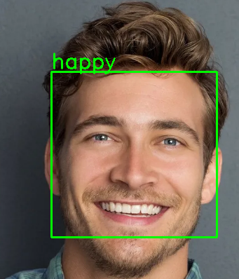

<h1>Introduction</h1>
To solve the problem of Face Expressions Reference, I decided to divide it into two stages: 
<br>1) Training the classifier on the available data<br>2) Face detection

<h1>Installing packages</h1>
In order for my project to work on your device, you need to install certain libraries.

````
pip install -r requirements.txt
````

<h1>Data</h1>
I used a dataset from a Kaggle competition. If you want to repeat all my actions, then download this dataset <a href="https://www.kaggle.com/datasets/msambare/fer2013">here</a>. 
Augmentation data is needed before training. Used augmentation, which is used in the CIFAR10 dataset. I made it so that you only need to run <code>train.py</code>.

<h1>Train</h1>
I first chose RegNet for training, because I was interested in the architecture of this network and I used Transfer Learning technology. Then I took everyone's favorite ResNext :) and used the same technology as RegNet when training. To start, run this script: <br>

````
train.py
````

<h1>Convert to ONNX</h1>

Before launching image_detect_class.py or video_detect_class.py I recommend running conver2onnx.py , since it is needed for further work of scripts.
Why did I decide to convert to ONNX format? After reading the article about ONNX, I wanted to use this technology in my project, since ONNX helps to optimize the output of the model and not only that.

<h1>Image or Live Video</h1>
To detect and classify an image, use the script: 

````
python img_detect_class.py example1.png
````

Or you want to detect and classify more than one image, then you need to enter the --image argument before the paths to the images:


````
python img_detect_class.py --images example1.png example2.jpg
````


To detect and classify an live video, use the script: 

````
video_detect_class.py
````

<h1>Example work. Before and After.</h1>

<p float="left">


 
</p>

<h1>Conclusion</h1>
This project was created for educational and practical purposes, I am ready to listen to your criticism and suggestions!
